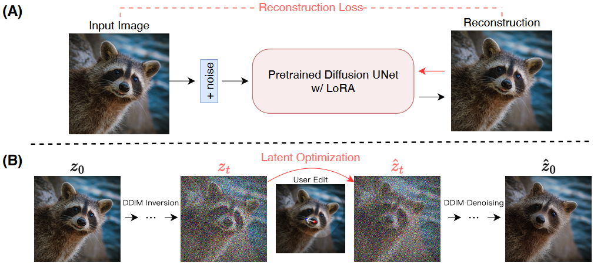

# DragDiffusion
Unofficial implementation of [DragDiffusion: Harnessing Diffusion Models for Interactive Point-based Image Editing](https://arxiv.org/abs/2306.14435).

```shell
# requirements
conda env create -f environment.yml
conda activate DragDiffusion
pip install -r requirements.txt
# To obtain the feature from StableDiffusion Unet (WIP)
mv assets/unet_2d_condition.py YOUR_CONDA_ENV/site-packages/diffusers/models/
# run demo
python visualizer_drag_gradio.py
```

# TODO
- [x] drag process
- [x] mask
- [x] Gradio GUI
- [ ] imgui GUI

# StableDiffusion Pre-Trained Model
Following [Diffusers](https://github.com/huggingface/diffusers) to obtain pre-trained StableDiffuison model.

# References
- https://github.com/rosinality/stylegan2-pytorch
- https://github.com/huggingface/diffusers/blob/main/examples/dreambooth/train_dreambooth_lora.py